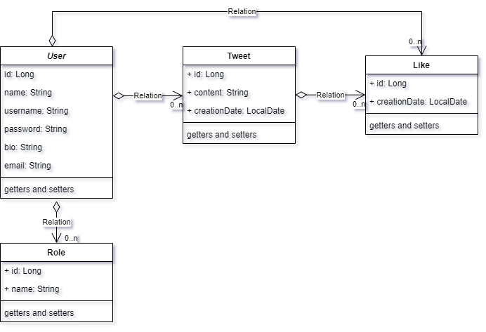

# twitter-clone

## Class Diagram


## Users API design

| **HTTP Method** | **Path**                                       | **Description**              |
|-----------------|------------------------------------------------|------------------------------|
| GET             | /users/{username}                              | Get user by username         |
| PUT             | /users                                         | Update user data             |
| DELETE          | /users/{id}                                    | Delete user by id            |
| GET             | /users?pageSize=10&pageNo=1&sortingBy=username | Pagination and sorting users |

## Tweet API design

| **HTTP Method** | **Path**                                                  | **Description**                     |
|-----------------|-----------------------------------------------------------|-------------------------------------|
| GET             | /users/tweets?pageSize=10&pageNo=1&sortingBy=creationDate | Get all tweets paginated and sorted |
| GET             | /users/{username}/tweets                                  | Get tweets by user username         |
| POST            | /users/{username}/tweets                                  | Create new tweet                    |
| PUT             | /users/{username}/tweets/{id}                             | Update tweet content                |
| DELETE          | /users/{username}/tweets/{id}                             | Delete tweet by id                  |

## Like API design

| **HTTP Method** | **Path**                            | **Description** |
|-----------------|-------------------------------------|-----------------|
| POST            | /users/{username}/tweets/{id}/likes | Create new like |
| DELETE          | /users/{username}/tweets/{id}/likes | Delete like     |

## Authentication API design

| **HTTP Method** | **Path**     | **Description** |
|-----------------|--------------|-----------------|
| POST            | /auth/login  | login           |
| POST            | /auth/signup | signup          |

# JWT configuration with spring security

- To customize Spring Security, we need a config class annotated with @EnableWebSecurity. That extends the WebSecurityConfigurerAdapter class and override both of its functions to customize the http security and authentication manager.
- In this class we will include our UserRepo class as a dependency in order to get the user information from our database.
- In order to authenticate the user using the User entity this should implement the UserDetails interface.
- In the authentication manager config we will use a lambda function to get the User entity with the UserRepo.
- Then we have to configure our Http Security, here we need to:
    - Enable CORS and disable CSRF.
    ```java
    http.cors().and().csrf().disable();
    ```
    - Set session management to stateless.
     ```java
    http.sessionManagement().sessionCreationPolicy(SessionCreationPolicy.STATELESS).and();
    ```
    - Set unauthorized requests exception handler, we need to create a class that implements the interface AuthenticationEntryPoint.
     ```java
    http.exceptionHandling().authenticationEntryPoint(jwtAuthenticationEntryPoint);
    ```
    - Set permissions on endpoints.
     ```java
    http.authorizeRequests()
			.antMatchers(HttpMethod.GET, "/**").permitAll()
			//login and signup endpoints
			.antMatchers("/auth/**").permitAll()
			.anyRequest().authenticated();
    ```
    - Add JWT token filter, we need to create a class that implements the interface OncePerRequestFilter so everytime we receive a request we will check the Authorization header and if it has a valid token we will add it to the Security context holder.
     ```java
    http.addFilterBefore(jwtAuthenticationFilter(), UsernamePasswordAuthenticationFilter.class);
    ```
-The last step is to expose the Authentication manager as a Bean
```java
@Override
	@Bean
	public AuthenticationManager authenticationManagerBean() throws Exception {
		return super.authenticationManagerBean();
	}
```

